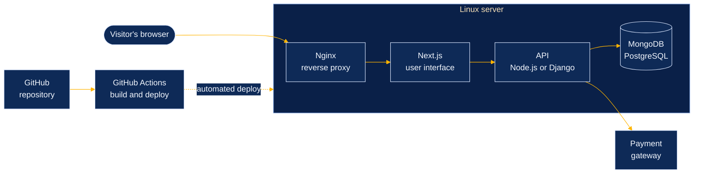

  
  
    
  
    
   &nbsp;&rarr;&nbsp;  &nbsp;&rarr;&nbsp;  &nbsp;&rarr;&nbsp;  &nbsp;&rarr;&nbsp; 
    
  <a href="#about"><b>About</b></a> &nbsp;|&nbsp;
  <a href="#request-path"><b>Request path</b></a> &nbsp;|&nbsp;
  <a href="#work"><b>Work</b></a> &nbsp;|&nbsp;
  <a href="#skills"><b>What I do</b></a> &nbsp;|&nbsp;
  <a href="#stack"><b>Stack</b></a> &nbsp;|&nbsp;
  <a href="#activity"><b>Activity</b></a> &nbsp;|&nbsp;
  <a href="#contact"><b>Contact</b></a>
    
     

 

<table align="center">
  <tr>
    <td>
      <ol>
        <li>I build secure, production-ready web applications and take them all the way to production myself.</li>
        <li>I work across the whole stack: interface, API, payments, database, and the Linux server it runs on.</li>
        <li>Computer Science student at EELU (B.Sc., expected 2027), freelancing since 2024.</li>
        <li><b>Open to full-time roles, including relocation.</b></li>
      </ol>
    </td>
  </tr>
</table>

 

Every project I ship follows the same route, from a visitor's browser to the database and back. I build each stage, and I deploy it myself.

 

<table>
  <tr>
    <td width="50%" align="center" valign="top">
       
      Online store built for the Saudi market. 
      
    </td>
    <td width="50%" align="center" valign="top">
       
      Online store built for the Egyptian market. 
      
    </td>
  </tr>
  <tr>
    <td width="50%" align="center" valign="top">
       
      Live product, built and deployed end to end. 
      
    </td>
    <td width="50%" align="center" valign="top">
       
      Full-stack platform, deployed on Vercel. 
      
    </td>
  </tr>
  <tr>
    <td width="50%" align="center" valign="top">
       
      Responsive marketing page, deployed on Vercel. 
      
    </td>
    <td width="50%" align="center" valign="top">
       
      Responsive marketing page, deployed on Vercel. 
      
    </td>
  </tr>
</table>

 

<table>
  <tr>
    <td width="33%" valign="top">
      <h4>Backend and APIs</h4>
      <ul>
        <li>Secure REST APIs with Node.js, Express, and Django</li>
        <li>Data models in MongoDB and PostgreSQL</li>
        <li>Clean interfaces between the front end and the server</li>
      </ul>
    </td>
    <td width="33%" valign="top">
      <h4>Payments and integrations</h4>
      <ul>
        <li>Payment gateways wired into real stores</li>
        <li>Webhooks and third-party services</li>
        <li>Checkout flows tested before launch</li>
      </ul>
    </td>
    <td width="33%" valign="top">
      <h4>Deployment</h4>
      <ul>
        <li>Linux servers configured with Nginx</li>
        <li>Docker for repeatable environments</li>
        <li>GitHub Actions for automated CI/CD deploys</li>
      </ul>
    </td>
  </tr>
</table>

 

<table align="center">
  <tr><td align="right"><b>Languages</b></td><td></td></tr>
  <tr><td align="right"><b>Front end</b></td><td></td></tr>
  <tr><td align="right"><b>Back end</b></td><td></td></tr>
  <tr><td align="right"><b>Data</b></td><td></td></tr>
  <tr><td align="right"><b>Delivery</b></td><td></td></tr>
</table>

 

  
  

  

 

> [!TIP]
> Hiring for a full-stack role? I'm open to full-time opportunities, including relocation. Send me a message and I'll reply.

  
  
  

